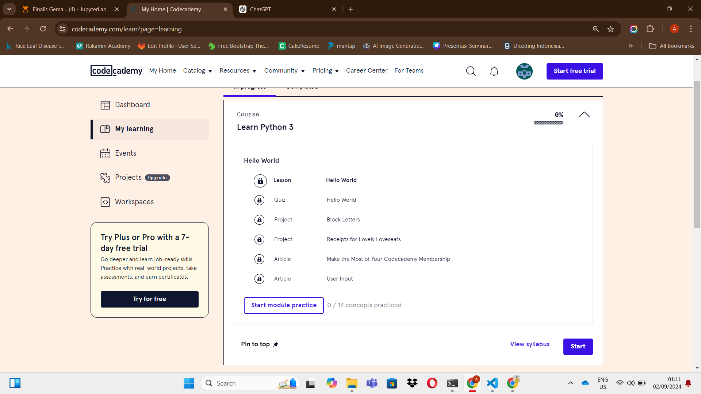
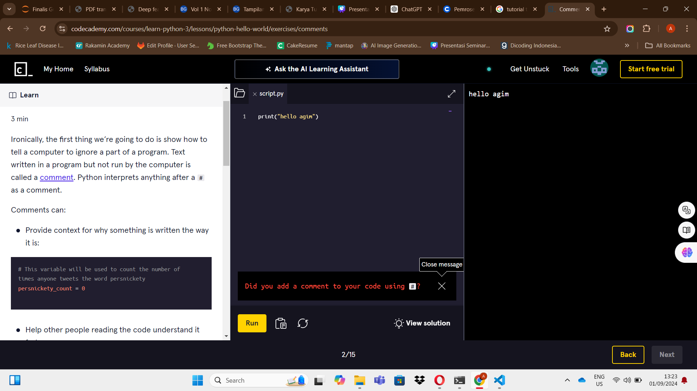
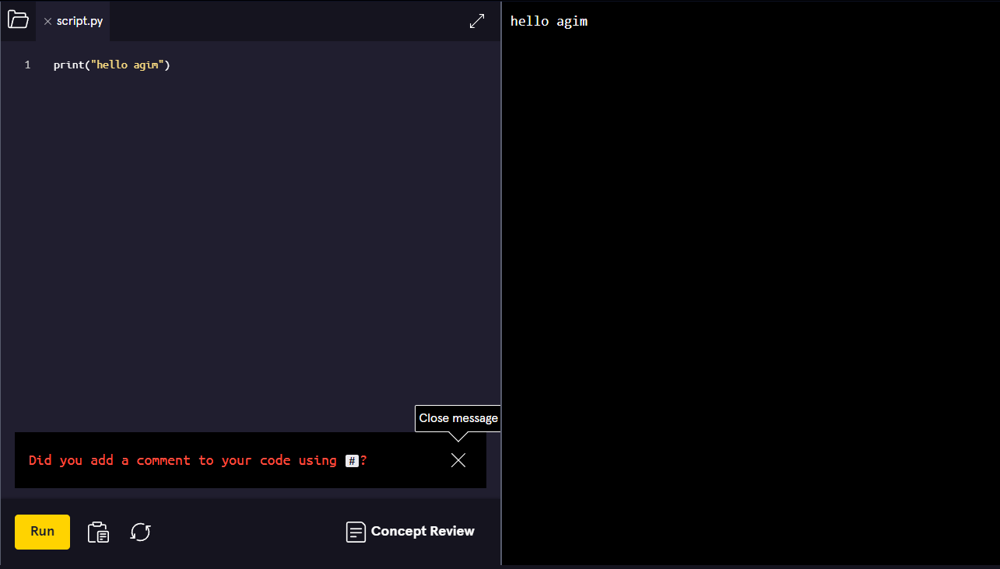

## Tugas Review Aplikasi

Nama        : M. Gymnastiar  
NIM         : 2110131210004  
Mata Kuliah : Pembelajaran Berbantuan Komputer

<h1 align="center">CodeCademy</h1>

CodeCademy adalah platform belajar pemrograman online yang menawarkan berbagai bahasa dan teknologi dengan pendekatan interaktif. Platform ini dirancang untuk membantu pengguna belajar secara praktis dan terstruktur.

Klik Disini Untuk Mencoba [Codecademy](https://www.codecademy.com/learn)

### Apa saja yang dapat dipelajari di CodeCademy?

    Di CodeCademy, pengguna dapat mempelajari berbagai topik, termasuk:

<ul>
    <li>Bahasa Pemrograman:
        <ul>
            <li>Python, JavaScript, HTML & CSS, SQL, Java, C++, C#, Bash, PHP, R, Swift</li>
        </ul>
    </li>
    <li>Konsep dan Teknologi:
        <ul>
            <li>Cloud Computing, Artificial Intelligence (AI), Web Development, Data Science, Web Design</li>
        </ul>
    </li>
    <li>Kursus Spesifik:
        <ul>
            <li>Full-Stack Engineer, Back-End Engineer, iOS Developer, Front-End Engineer, Computer Science</li>
        </ul>
    </li>
</ul>

    Sebagai tutor, CodeCademy menyediakan kursus interaktif dengan modul yang mencakup teks, video, dan latihan coding. Pengguna mendapatkan umpan balik langsung dan proyek praktis untuk mengevaluasi kemajuan mereka.

    Sebagai alat bantu, CodeCademy menawarkan editor kode online dan proyek praktis yang memungkinkan pengguna menerapkan konsep dalam situasi nyata. Ini memudahkan pengguna untuk belajar dan mempraktikkan keterampilan tanpa berpindah halaman.

    Dalam CodeCademy, pengguna berlatih menulis kode untuk menginstruksikan komputer, melihat hasil langsung, dan mengembangkan solusi secara real-time melalui proyek dan latihan interaktif.

